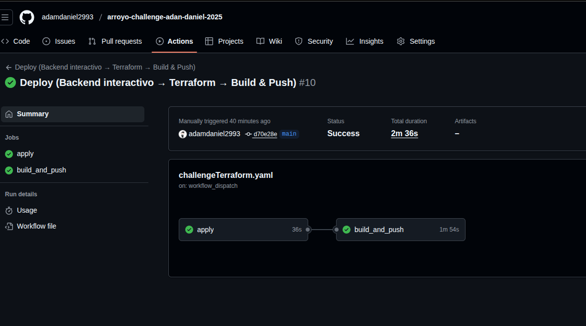
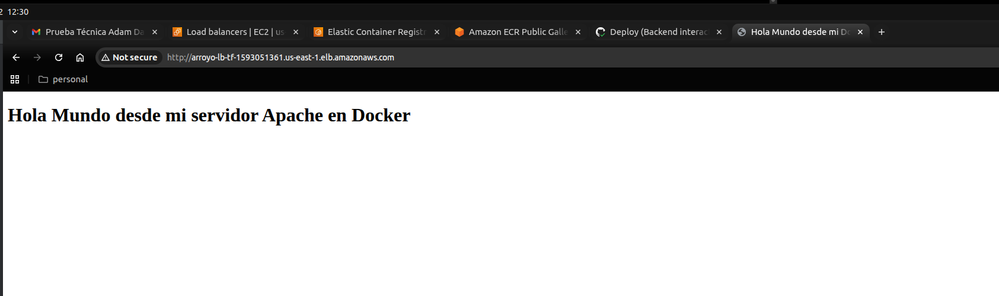

### Debe haber conexión entre el Docker y el servicio de base de datos elegido

**Implementación**: La conexión se cablea en la Task Definition de ECS pasando `DB_HOST/DB_NAME/DB_USER` como environment y `DB_PASSWORD` como secrets (SSM).

**Salud de la app**: El healthcheck de ECS usa `pg_isready` desde el contenedor. Si la base no es alcanzable, la tarea se marca unhealthy y se reinicia, evitando servir tráfico; el ALB solo enruta a targets saludables.

**Seguridad**: El **SG de RDS** permite **5432** solo desde el **SG de las tareas ECS (no desde Internet).**

---
### Concedernos acceso a la imagen de Docker publicada

**DockerHub Público**: https://hub.docker.com/r/adamdanielf/arroyo-2025/tags

**Uso**:

```
docker pull adamdanielf/arroyo-2025:latest
```

---

### Concedernos acceso a los archivos de Terraform creados

**Repositorio**: https://github.com/adamdaniel2993/arroyo-challenge-adan-daniel-2025

---
### Justificar por qué el tipo de servicio de cómputo y base de datos elegidos

**Cómputo (Amazon ECS en EC2, Linux)**: Control fino de capacidad (ASG + Launch Template), coste bajo en entornos pequeños, integración directa con ALB/CloudWatch, y trayectoria clara a Fargate o EKS sin reescribir la app.


**Base de datos (Amazon RDS for PostgreSQL)**: Servicio administrado (backups, parches, métricas), estándar y robusto para el reto; simplifica la conexión desde contenedor mediante variables y secretos.

--- 

### Es un plus cualquier configuración adicional realizada

* **Logs de contenedor a CloudWatch (driver `awslogs`)** en `/ecs/<proyecto>/app`.
* **Container Insights** habilitado (métricas y troubleshooting).
* **ALB access logs** en **S3** (auditoría de tráfico).
* **RDS logs** exportados a **CloudWatch Logs** (con aws_db_parameter_group).
* **Health checks** (ALB y ECS) para resiliencia de capa 7 + proceso.
* **Pipeline de despliegue** con **GitHub Actions** (bootstrap de backend, `terraform apply`, build & push a ECR público).

---

### Explicarnos cómo la prueba será ejecutada (Manualmente o con un pipeline)

**Opción recomendada** – Pipeline (GitHub Actions):

Workflow: `.github/workflows/challengeTerraform.yaml`

Ir a **Actions** → **challengeTerraform** → **Run workflow**, completar inputs (p. ej. `aws_region=us-east-1`, `tf_state_bucket=<bucket-s3>`, `tf_lock_table=terraform-state-locks`, `tf_state_key=arroyo-challenge/terraform.tfstate`).

El pipeline **bootstrap** el backend (S3+DynamoDB), ejecuta `terraform init` con `--backend-config`, corre `terraform apply` (crea ECR público y/o infra), y luego hace **login** → **build** → **push a ECR público**.

Si lo quieren ejecutar en mi cuenta no hay problema solo notifiquenme via correo y estoy atento para correr un destroy y dejarles todo limpio


## ⚠️ Nota cuenta de AWS

El workflow de GitHub Actions está configurado con mis credenciales de AWS mediante **Repository Secrets** (`AWS_ACCESS_KEY_ID`, `AWS_SECRET_ACCESS_KEY`).

Si ejecutan el pipeline tal cual, desplegará en **mi cuenta**. Para evitarlo, por favor usen su propia cuenta:

#### Opción A — Ejecutar el pipeline en su cuenta de AWS

1. Hagan **fork** del repositorio a su organización/usuario.
2. En el fork, vayan a **Settings → Secrets and variables → Actions → New repository secret** y creen:

   * `AWS_ACCESS_KEY_ID`
   * `AWS_SECRET_ACCESS_KEY`


**Opción manual (local): Utilizando sus credenciales de AWS**
##### Backend remoto (S3 + DynamoDB ya existentes)
```
terraform init \
  -backend-config="bucket=<BUCKET>" \
  -backend-config="key=arroyo-challenge/terraform.tfstate" \
  -backend-config="region=us-east-1" \
  -backend-config="dynamodb_table=terraform-state-locks" \
  -backend-config="encrypt=true"

terraform apply

### Publicar imagen en ECR público
ECR_URI=$(terraform output -raw ecr_repository_url)
aws ecr-public get-login-password --region us-east-1 | docker login --username AWS --password-stdin public.ecr.aws
docker build -t "${ECR_URI}:latest" -t "${ECR_URI}:$(git rev-parse --short HEAD)" .
docker push "${ECR_URI}:latest"
docker push "${ECR_URI}:$(git rev-parse --short HEAD)"
```
---

### Explique el uso y gestión del state file y dónde está almacenado

**Backend remoto**: S3 con versioning y cifrado de servidor (AES-256).

**Locking de estado**: DynamoDB tabla `terraform-state-locks` para evitar ejecuciones concurrentes sobre el mismo state.

**Buenas prácticas**: usar `terraform init -migrate-state` si cambia la config del backend; no editar el state manualmente.

---

### Gestión del .terraform.lock.hcl:
En este reto la ejecución de Terraform ocurre en GitHub Actions. El lock file se genera en el runner durante **terraform init** y no se commitea por defecto.
**Para asegurar reproducibilidad**:

El pipeline ejecuta `terraform init` sin `-upgrade`, **respetando versiones fijadas en required_providers**. Por lo que se asegura la reproducibilidad ya que se respeta las versiones configuradas

**(Independiente del lock file)** el **state se guarda en S3** y se bloquea con DynamoDB, evitando ejecuciones concurrentes.

En todo caso se puede crear un workflow que cree el lock y lo comitee al repo

--- 
### (Contexto de seguridad SSH)

En la configuracion del security group configure mis ips publicas para ser capaz de acceder via ssh ya que mencionan este punto en la prueba

**"Crear políticas de seguridad para el acceso SSH (por ejemplo, restricción de IPs)."**

---
### Pruebas adicionales


